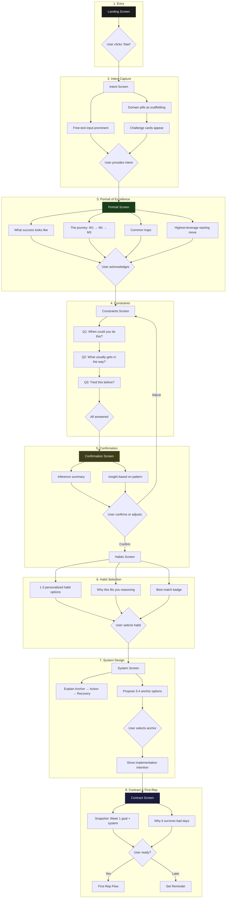

# Habit Stacker Setup Wizard — Design Feedback & Recommended Flow

## Summary

The current proof-of-concept has the right components but in the wrong order. The core issue is **sequencing**: we collect constraints before users have context to care, and show "what excellence looks like" after they've already made commitments. The fix is reordering steps and collapsing unnecessary screens—not rebuilding from scratch.

---

## Consolidated Feedback

### High-Level Issues

| Issue | Description | Recommendation |
|-------|-------------|----------------|
| **Sequencing inversion** | Portrait of Excellence appears at step 6 of 8, after users have answered generic questions about a habit they haven't chosen. Should come early to build trust and justify the intake questions. | Move Portrait to position 2, immediately after intent capture. |
| **Domain-first friction** | Users don't think in abstract domains ("Health & Fitness"). They think in concrete frustrations ("I keep skipping morning workouts"). Forcing domain selection upfront creates unnecessary cognitive load. | Accept free-text input first, show domains as scaffolding pills for users who are stuck. |
| **Generic questionnaire** | Questions like "Where would you do this?" don't make sense until a specific habit is chosen. For sleep habits, asking about location is absurd. Questions feel like interrogation, not conversation. | Reduce to 3 questions, move after Portrait, tailor questions to domain (skip location for sleep). |
| **Confirmation shows receipt, not inference** | "You said mornings, you're at your best, it slips your mind" reads back selections. It doesn't demonstrate understanding. | Rewrite confirmation to show synthesis: "You've tried this many times—motivation isn't the issue. The system is. Let's fix that." |
| **System design is passive** | User reads about Anchor → Action → Recovery but doesn't make any decisions. Violates PRD principle of "one decision per consult step." | Make anchor selection interactive—propose 2-3 options, user locks one. |
| **Back-loaded value** | The "aha moment" (personalized snapshot) comes too late. Users invest 2-3 minutes before seeing payoff. | Front-load context (Portrait), compress intake, get to habit recommendation faster. |

### Screen-Level Issues

| Screen | Issue | Fix |
|--------|-------|-----|
| **Landing** | Copy is functional but not motivating. "Design one small habit system" is process-speak. | Reframe around relief: "Finally, a system that won't punish you for missing a day." |
| **Domain selection** | Cards are clean but step indicator (1-6) signals length and creates anxiety. | Consider progressive step reveal or hide total count. |
| **Challenge selection** | No escape valve for users whose challenge isn't listed. | Add "Or describe what you want to work on" text input below cards. |
| **Questionnaire (5 questions)** | Too many questions. Location question doesn't apply to all domains. Energy can be inferred from timing. | Reduce to 3: timing, barrier, previous attempts. |
| **Confirmation** | Thin synthesis—just restates what user clicked. | Show inference with insight: "The fact that you keep coming back means the desire is real. The issue isn't motivation—it's the system." |
| **Portrait of Excellence** | Content is strong. Placement is wrong. | Move to position 2 (after intent, before questions). |
| **Habit recommendations** | Good structure. "Best match" badge works. | Make personalization reasoning more prominent. |
| **System design** | Read-only. User doesn't participate. | Add anchor selection (3-4 options + custom input). |

### Copy & Tone Issues

| Current | Problem | Suggested |
|---------|---------|-----------|
| "What area of life do you want to improve?" | Abstract, feels like a survey | "What feels stuck?" |
| "Pick one domain. We'll design a small, survivable habit system together." | Process-speak | Cut second sentence entirely |
| "A few quick questions" | Sets low expectations, feels like forms | "Quick context" or remove header entirely |
| "This helps us recommend a habit that fits your life." | Generic | "To recommend the right starting point, I need to know a few things." (Move after Portrait so it's justified) |
| "Let me make sure I understand" | Good intent, weak execution | Keep header, rewrite body to show inference |

### Structural Recommendations

1. **Combine Domain + Challenge into single "Intent" screen** with free-text input prominent and domain pills as progressive filter
2. **Move Portrait of Excellence to position 2** — it earns the right to ask questions
3. **Reduce questionnaire from 5 → 3 questions** — cut location (context-dependent) and energy (inferable)
4. **Rewrite Confirmation as inference** — show synthesis, not receipt
5. **Add interaction to System design** — user selects anchor from options
6. **Compress progress indicator** — 5 steps instead of 6

---

## Recommended Flow

### Flow Comparison

**Current (8 logical steps):**
```
Landing → Domain → Challenge → Q1 → Q2 → Q3 → Q4 → Q5 → Confirmation → Portrait → Habits → System → Contract
```

**Recommended (6 logical steps):**
```
Landing → Intent (combined) → Portrait → Constraints (3 Qs) → Confirmation → Habits → System (interactive) → Contract
```

### Mermaid Diagram



### Screen-by-Screen Specification

#### Screen 1: Landing
- **Purpose:** Set expectations, create emotional hook
- **Content:**
  - Headline: "Habit Stacker"
  - Subhead: "Finally, a system that won't punish you for missing a day."
  - Supporting: "2 minutes to design. Your first rep today."
  - CTA: "Design my habit system"

#### Screen 2: Intent
- **Purpose:** Capture what user wants to work on without forcing abstract categorization
- **Content:**
  - Headline: "What feels stuck?"
  - Subhead: "Pick something you've been meaning to work on, or tell me in your own words."
  - Free-text input (prominent)
  - "or pick a common challenge" divider
  - Domain pills (Health, Finances, Home, Learning)
  - When domain selected → Challenge cards appear below
  - Escape valve: text input always available
- **Exits:** User has either typed intent OR selected domain + challenge

#### Screen 3: Portrait of Excellence
- **Purpose:** Build trust, show expertise, justify upcoming questions
- **Content:**
  - Headline: "What success actually looks like"
  - Subhead: "Before we design your system, here's what I know about people who build lasting [domain] habits."
  - Section: "People who succeed at this" (3-4 bullets)
  - Section: "The journey" (Week 1 → Month 1 → Month 3)
  - Section: "Common traps to avoid" (2-3 warnings)
  - Section: "Highest-leverage starting move" (1 key insight)
  - CTA: "This makes sense"
- **Note:** Content is domain-specific, AI-generated, read-only

#### Screen 4: Constraints (3 questions)
- **Purpose:** Gather minimal context needed for personalization
- **Content:**
  - Progress indicator: "Quick context (1/3)"
  - Questions presented one at a time with transition
  - **Q1:** "When could you realistically do this?" → Morning / Evening / Flexible
  - **Q2:** "What usually gets in the way?" → I forget / Too tired / No time / Hard to start
  - **Q3:** "Have you tried building this habit before?" → First time / Once or twice / Many times
- **Interaction:** Tap-based, auto-advance on selection, <30 seconds total

#### Screen 5: Confirmation
- **Purpose:** Demonstrate understanding, build trust before prescribing
- **Content:**
  - Headline: "Here's what I'm hearing"
  - Inference block: Synthesized summary (not receipt of selections)
  - Insight block: Pattern-based observation with reframe
  - Prompt: "Does this sound right?"
  - CTA: "Yes, that's me"
  - Secondary: "Let me adjust my answers" → back to Constraints
- **Example inference:** "You've tried this many times, but it keeps slipping off your radar. The fact that you keep coming back means the desire is real. The issue isn't motivation—it's the system."

#### Screen 6: Habit Recommendations
- **Purpose:** Answer "What should I actually do this week?"
- **Content:**
  - Headline: "Your Week-1 habit"
  - Subhead: "Based on your answers, here's what I'd recommend starting with."
  - Personalization badge: "Personalized for: [timing], [barrier], [attempts]"
  - 1-3 habit cards, each with:
    - Habit title (concrete behavior)
    - Brief description
    - "Why this fits you" reasoning tied to questionnaire answers
    - Suggested anchor (preview)
    - "Best match" badge on top recommendation
  - Context: "Week 1 is about showing up. These are intentionally small."
  - CTA: "This is my Week-1 habit"

#### Screen 7: System Design (Interactive)
- **Purpose:** Turn chosen habit into survivable system via anchor selection
- **Content:**
  - Headline: "Making it stick"
  - Subhead: "Your habit needs an anchor—something you already do that triggers the new behavior."
  - System model explanation (Anchor → Action → Recovery)
  - Headline: "Pick your anchor"
  - 3-4 anchor options based on domain + timing (e.g., "After brushing teeth," "After dinner cleanup")
  - Custom option: "Something else..."
  - On selection → Show implementation intention preview: "After [anchor], I will [habit]."
  - CTA: "Lock this in"

#### Screen 8: Contract & First Rep
- **Purpose:** Create commitment, trigger immediate action
- **Content:**
  - Headline: "Your Week-1 system"
  - Snapshot card:
    - "Week 1 goal: Show up."
    - "After [anchor], [habit]."
    - Visual: Anchor / Action / Recovery icons
  - Explanation: "Why this system survives bad days"
  - CTA: "Start my first rep (takes 2 min)"
  - Secondary: "Remind me later today"

---

## Implementation Priorities

### Iteration 1: Reorder without rewriting
- Move Portrait component to after Intent, before Constraints
- Single component move, test whether flow feels more justified

### Iteration 2: Collapse questionnaire
- Reduce from 5 → 3 questions
- Remove "Where would you do this?" and "Energy level"
- Keep timing, barrier, previous attempts

### Iteration 3: Add free-text to Intent
- Add text input above domain pills
- Route typed input through AI classification
- Domain pills become secondary path

### Iteration 4: Rewrite Confirmation
- Replace selection receipt with inference synthesis
- Add insight block with pattern-based reframe
- Requires prompt engineering for AI inference

### Iteration 5: Make System Design interactive
- Add anchor selection (3-4 options + custom)
- Show implementation intention on selection
- User "locks" anchor before proceeding

---

## Open Questions for Next Iteration

1. **Free-text parsing:** How do we handle ambiguous or multi-goal free-text input? Clarification flow? AI suggests best-fit domain?

2. **Portrait content generation:** Is Portrait fully AI-generated per domain, or templated with AI fills? Quality bar is high here.

3. **Confirmation inference quality:** The inference needs to feel genuinely insightful, not formulaic. What's the prompt structure?

4. **Anchor suggestions:** How do we generate contextually appropriate anchors? Need to factor in timing preference and domain.

5. **Progress indicator:** Show all 5 steps upfront, or reveal progressively? Trade-off between expectation-setting and anxiety.